# Write-up: Creación de ambiente de trabajo — Desarrollo de Software Seguro

**Autor:** Rodrigo Perdomo

**Fecha:** 7 de agosto de 2026

Este documento describe, paso a paso, el armado del ambiente de pruebas de aplicaciones utilizado en las prácticas de la materia: una máquina virtual Kali Linux con Burp Suite, Visual Studio Code y Docker, sobre la cual se ejecutan OWASP Juice Shop y crAPI en contenedores, y se configura la interceptación de tráfico HTTP/HTTPS con FoxyProxy y el certificado CA de Burp.

> **Disclaimer:** la redacción de este documento es propia. La organización del material —estructura de directorios, nomenclatura de archivos y disposición de las capturas de pantalla— fue realizada con la asistencia de una herramienta de IA.

## Índice

- [1. Instalación de una máquina virtual de Kali Linux](#1-instalación-de-una-máquina-virtual-de-kali-linux)
  - [1.1 Creación de la máquina virtual y selección de la imagen](#11-creación-de-la-máquina-virtual-y-selección-de-la-imagen)
  - [1.2 Ajuste de recursos de hardware](#12-ajuste-de-recursos-de-hardware)
  - [1.3 Asistente de instalación de Kali Linux](#13-asistente-de-instalación-de-kali-linux)
  - [1.4 Primer arranque](#14-primer-arranque)
  - [1.5 Instalación de pimpmykali](#15-instalación-de-pimpmykali)
- [2. Instalación del proxy de interceptación (Burp Suite)](#2-instalación-del-proxy-de-interceptación-burp-suite)
- [3. Instalación de Visual Studio Code](#3-instalación-de-visual-studio-code)
- [4. Instalación de Docker](#4-instalación-de-docker)
- [5. Ejecución de OWASP Juice Shop en ambiente dockerizado](#5-ejecución-de-owasp-juice-shop-en-ambiente-dockerizado)
- [6. Ejecución de crAPI en ambiente dockerizado](#6-ejecución-de-crapi-en-ambiente-dockerizado)
- [7. Prueba de visualización del tráfico en el proxy de interceptación](#7-prueba-de-visualización-del-tráfico-en-el-proxy-de-interceptación)
  - [7.1 Configuración de FoxyProxy](#71-configuración-de-foxyproxy)
  - [7.2 Instalación del certificado CA de Burp](#72-instalación-del-certificado-ca-de-burp)

## 1. Instalación de una máquina virtual de Kali Linux

Instalación de Kali Linux como máquina virtual en VMware Fusion, desde la descarga/importación de la imagen hasta tener el sistema operativo funcionando.

### 1.1 Creación de la máquina virtual y selección de la imagen

Arranqué desde la ventana principal de VMware Fusion.

- Le di a crear una nueva máquina virtual.
- Elegí "Install from disc or image" y le apunté a la imagen ISO de Kali Linux que ya tenía descargada.
- Confirmé que esa era la imagen correcta.
- Dejé que VMware detectara el sistema operativo (lo reconoció como "Other Linux 6.x kernel 64-bit Arm") y aplicara su configuración recomendada.

**Resultado:** la máquina virtual quedó creada, con la imagen de Kali asociada, lista para tocarle los recursos antes de instalar.

### 1.2 Ajuste de recursos de hardware

**1.6** Revisión de recursos: me parece poco disco, poca memoria y poco CPU, hay que cambiarlo.
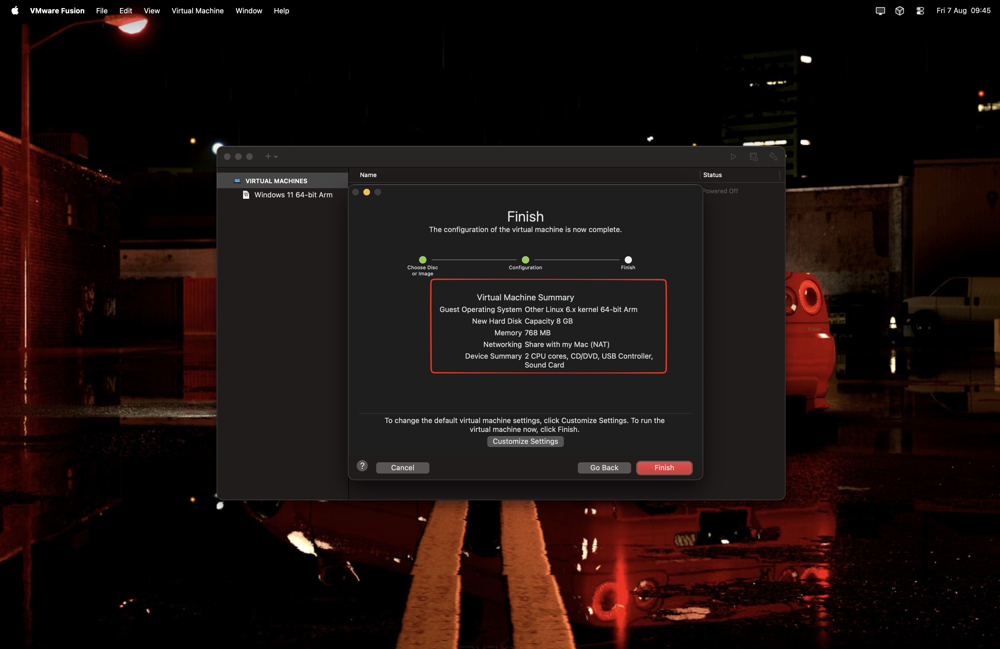

Antes de arrancar la instalación miré el resumen que te muestra VMware al terminar el asistente y los valores por defecto no me convencieron para nada: apenas 8 GB de disco, 768 MB de RAM y 2 núcleos de CPU. Con eso corriendo Kali, más Docker, Burp y VS Code encima, se iba a arrastrar.

- Entré a la configuración de hardware de la VM, a la sección "Processors & Memory".
- Subí el procesador de 2 a 4 núcleos.
- Subí la memoria de 768 MB a 2048 MB (VMware me avisaba que me quedaban 16 GB libres para el Mac, así que había margen de sobra).
- También agrandé el disco, que terminó quedando en unos 32 GB en vez de los 8 GB iniciales.

**Resultado:** la VM quedó con 4 núcleos, 2048 MB de RAM y ~32 GB de disco — recursos de sobra para bancarse el resto del ambiente que se instalaría después.

### 1.3 Asistente de instalación de Kali Linux

Con la VM ya redimensionada, arranqué el instalador y fui completando el asistente paso a paso.

- Elegí la instalación gráfica en vez de la instalación por texto, para más placer.
- Dejé el sistema en inglés.
- Location en USA, algo indiferente para este caso de uso.
- Teclado en inglés, igual que en mi máquina física.
- Como hostname puse microwave.
- Dejé el domain name en blanco, no era necesario.
- Como nombre completo del usuario nuevo puse donald.
- Como username (el que aparece en el login) quedó también donald.
- Elegí una password supersecreta y supersegura.
- Entré al asistente de particionado y elegí el disco destino: /dev/nvme0n1, de 32.2 GB.
- Usé una sola partición para todo el sistema, no hacían falta más para este caso.
- Confirmé el esquema de particiones y grabé los cambios en disco.
- Dejé la selección de herramientas por defecto de Kali para instalar.

**Resultado:** el instalador terminó de copiar todo y pidió reiniciar para arrancar por primera vez el Kali ya instalado.

### 1.4 Primer arranque

Reinicié la VM para que booteara por primera vez desde el disco recién instalado.

**Resultado:** el sistema llegó a la pantalla de login de Kali con el usuario donald y el hostname microwave, confirmando que la instalación había quedado funcional.

**1.27** Presentación de la pantalla de login.
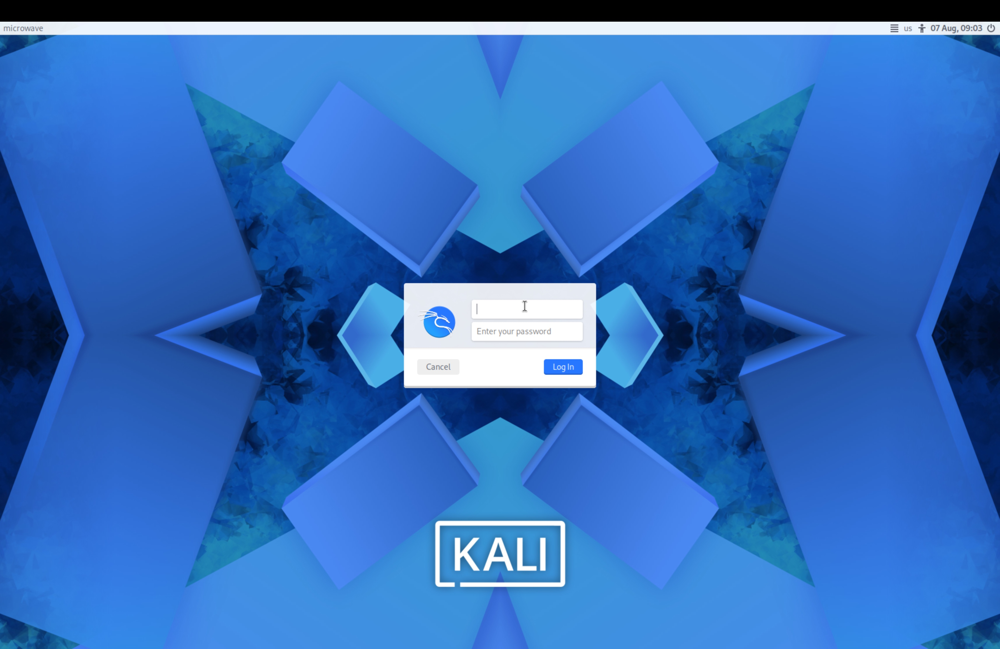

### 1.5 Instalación de pimpmykali

En Kali recién instalado, un apt update a lo bruto suele romper cosas (repositorios desactualizados, paquetes en conflicto), así que preferí ir por un camino más seguro y usar pimpmykali, una herramienta pensada justo para dejar un Kali nuevo bien configurado.

- Me aseguré de no tener una carpeta pimpmykali previa: `rm -rf pimpmykali/`.
- Cloné el repositorio: `git clone https://github.com/Dewalt-arch/pimpmykali`.
- Entré a la carpeta: `cd pimpmykali`.
- Ejecuté el script con permisos de root: `sudo ./pimpmykali.sh`, usando la opción de menú pensada para una VM de Kali nueva (opción N, según indica el propio README del proyecto).

**Resultado:** el script corrió sin errores, dejando el sistema listo, y recomendó reiniciar una vez más para que todos los cambios quedaran aplicados.

**1.28** Clonar repo de pimpmykali porque apt update siempre rompe todo. Repositorio en: https://github.com/Dewalt-arch/pimpmykali
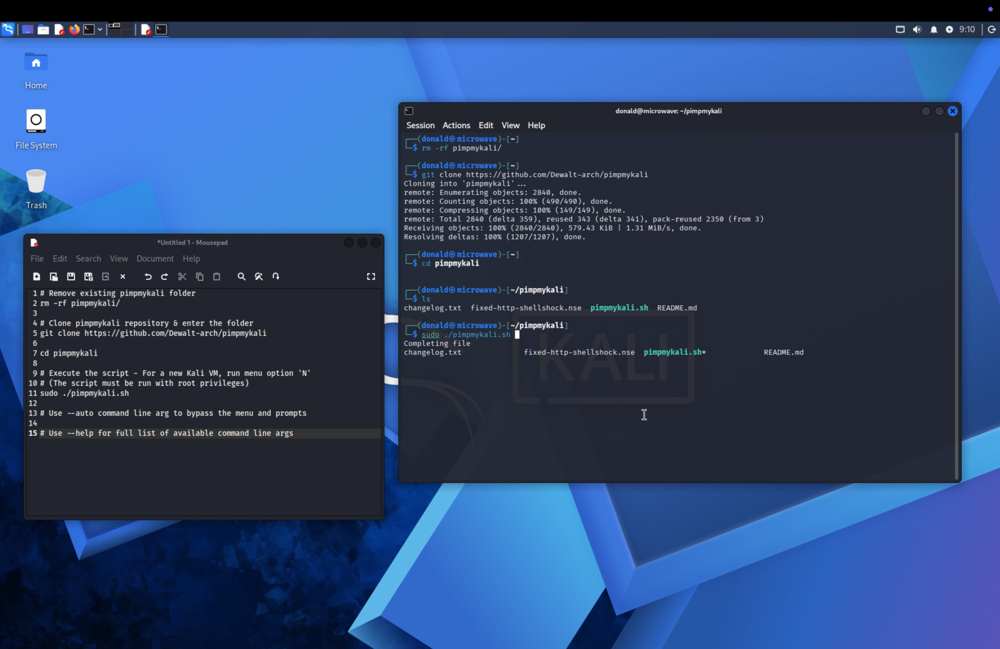

**1.29** Instalar pimpmykali para dispositivo nuevo.
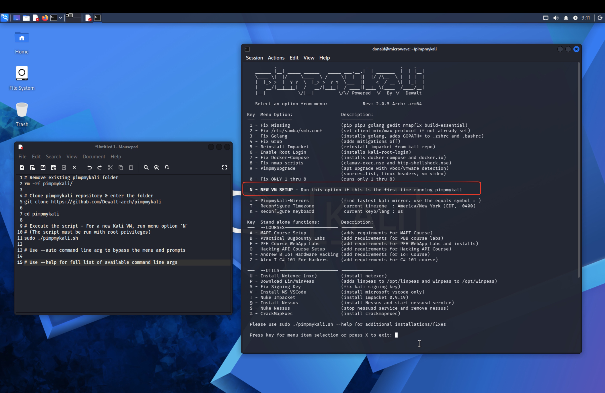

## 2. Instalación del proxy de interceptación (Burp Suite)

Instalación de Burp Suite Community Edition dentro de la máquina virtual Kali Linux.

Esta instalación la hice directamente por terminal.

- Primero me fijé si ya estaba instalado: `which burpsuite`, que devolvió "burpsuite not found".
- Como no estaba, lo instalé con `sudo apt install burpsuite -y`.
- Para confirmar que había quedado disponible, abrí el buscador de aplicaciones de Kali y tipeé "burp": apareció burpsuite listado como "platform for security testing of web applications".
- Lo abrí desde ahí.

**Resultado:** Burp Suite Community Edition arrancó sin problemas (versión v2026.7.2, proyecto temporal), mostrando la pestaña Proxy con el Intercept apagado por defecto.

**2.1** Validar que no exista la herramienta y presentar el comando de instalación.
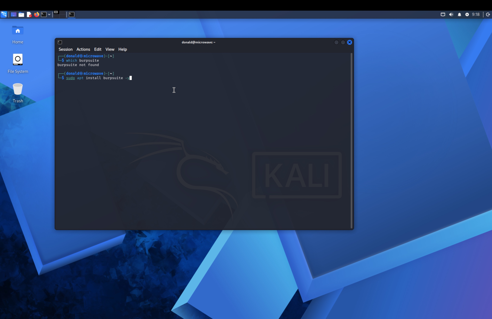

**2.2** Validar la instalación.
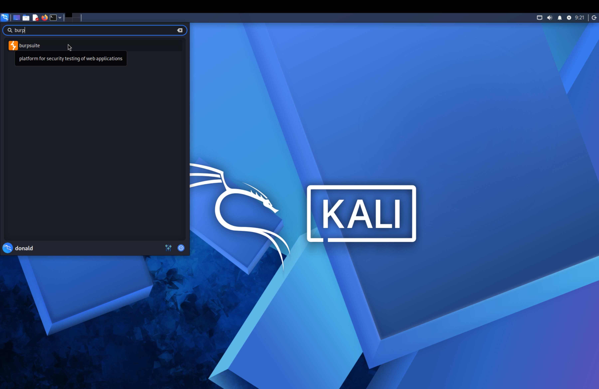

**2.3** Iniciar el programa satisfactoriamente.
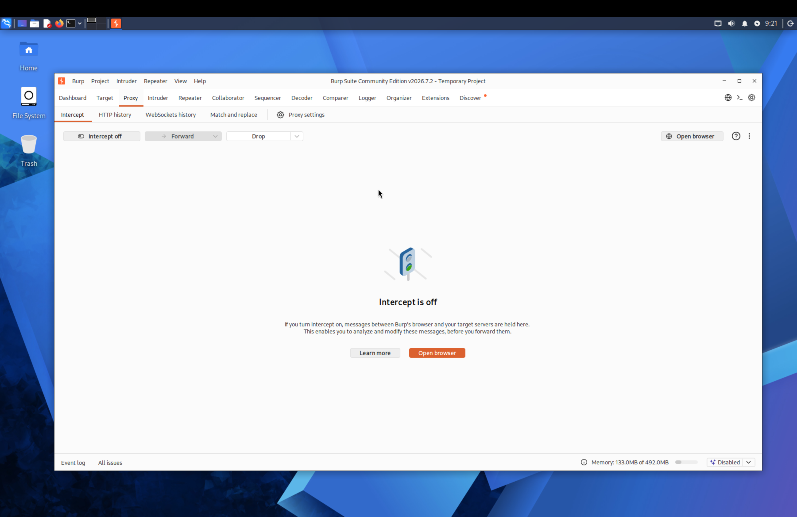

## 3. Instalación de Visual Studio Code

Instalación de Visual Studio Code en la máquina virtual Kali Linux.

Como la VM es Arm64, tuve que bajar el paquete .deb para esa arquitectura puntual en vez de usar el genérico.

- Descargué el instalador con `wget -O vscode-arm64.deb "https://code.visualstudio.com/sha/download?build=stable&os=linux-deb-arm64"` — la descarga terminó pesando 212 MB (222.029.254 bytes).
- Lo instalé con `sudo apt install ./vscode-arm64.deb -y`.
- Durante la instalación, el paquete preguntó si quería agregar el repositorio y la clave de firma de Microsoft para poder actualizar VS Code después vía apt. Elegí "No", ya que no lo necesitaba para este caso de uso (una sola instalación puntual).
- Abrí VS Code para confirmar que había quedado andando.

**Resultado:** Visual Studio Code arrancó correctamente, mostrando la pantalla de bienvenida ("Editing evolved"), listo para usarse.

**3.4** Visual Studio Code instalado correctamente.
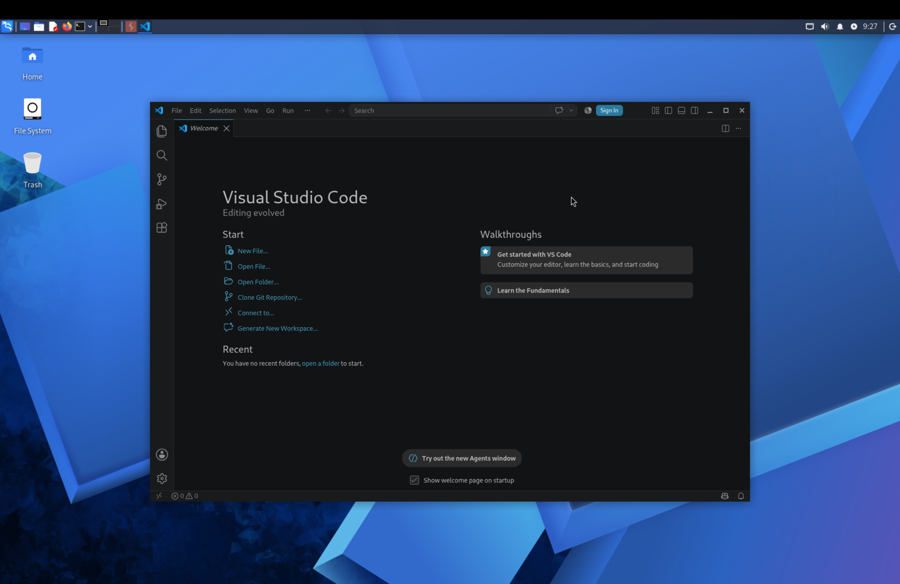

## 4. Instalación de Docker

Instalación de Docker en la máquina virtual Kali Linux.

- Primero me fijé si ya estaba instalado: `which docker`, que devolvió "docker not found".
- Lo instalé con `sudo apt install docker.io docker-compose -y` (no capturé pantalla de este comando puntual, pero es el que ejecuté).
- Durante la instalación, apt preguntó si quería eliminar todos los datos de Docker (imágenes, contenedores y volúmenes en /var/lib/docker) por si estuviera reemplazando una instalación anterior. Como no tenía ninguna instalación previa, elegí "Sí" sin que esto rompiera nada.
- Confirmé la instalación con `docker --version`, que devolvió "Docker version 28.5.2+dfsg4, build 9cc6dea".
- Habilité y arranqué el servicio: `sudo systemctl enable docker` y `sudo systemctl start docker`.
- Agregué mi usuario al grupo docker para no tener que anteponer sudo en cada comando: `sudo usermod -aG docker $USER`, y apliqué el cambio de grupo en la sesión actual con `newgrp docker`.
- Para probar que todo funcionaba, corrí un contenedor de prueba: `docker run hello-world`.

**Resultado:** Docker bajó la imagen hello-world:latest (arquitectura arm64v8), la corrió y mostró el mensaje "Hello from Docker! This message shows that your installation appears to be working correctly.", confirmando que el daemon y los permisos quedaron bien configurados.

**4.3** Validar la instalación de Docker.
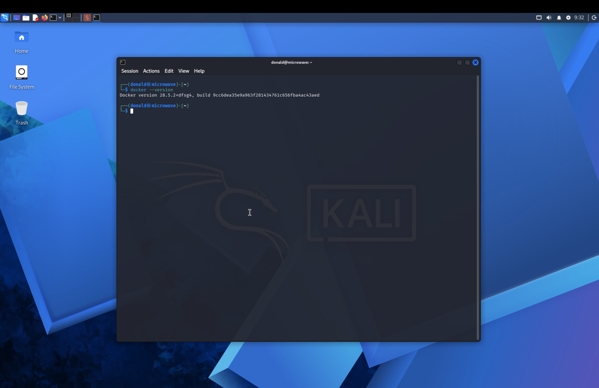

**4.4** Inicializar los daemon de Docker y validar que se puede levantar un contenedor de prueba.
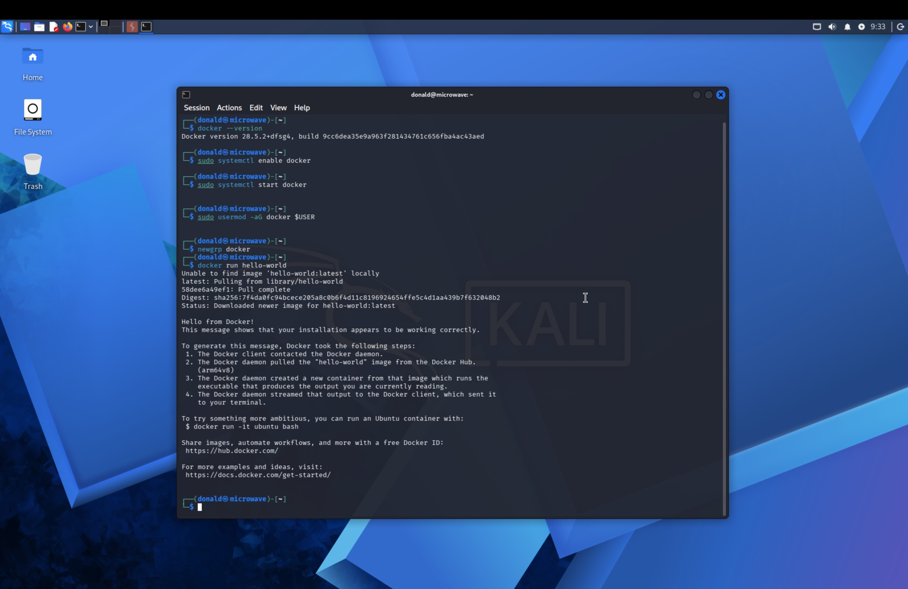

## 5. Ejecución de OWASP Juice Shop en ambiente dockerizado

Descarga y ejecución del contenedor de OWASP Juice Shop mediante Docker.

- Busqué en Docker Hub una imagen oficial de Juice Shop y encontré bkimminich/juice-shop (release v20.1.1, 110.8 MB, con más de 50M de descargas).
- Descargué la imagen con `docker pull bkimminich/juice-shop`.
- Levanté el contenedor en background, mapeando el puerto 3000 del contenedor al 3000 del host: `docker run -d -p 3000:3000 bkimminich/juice-shop`.
- Verifiqué que estuviera corriendo con `docker ps`: apareció el contenedor angry_wing (id 9739df3b2c36), con estado "Up" y el puerto 0.0.0.0:3000->3000/tcp expuesto.
- Entré desde el navegador a http://localhost:3000/#/.

**Resultado:** la aplicación OWASP Juice Shop cargó correctamente en el navegador, mostrando el catálogo de productos y el mensaje de bienvenida propio de la app.

**5.1** Busca en internet una imagen del Juice Shop para Docker.
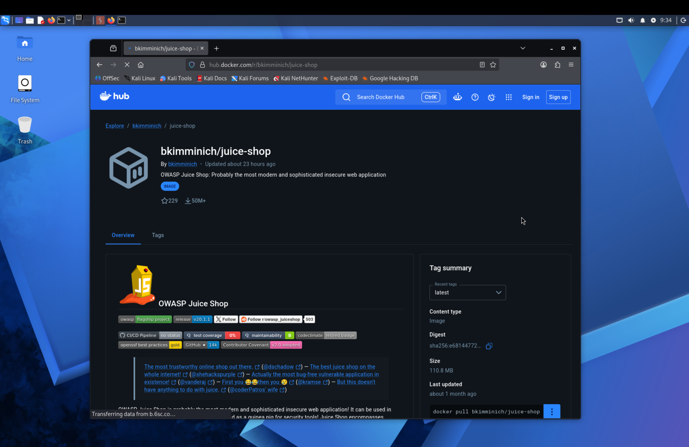

**5.6** Validar que se pueda entrar a la app en el navegador.
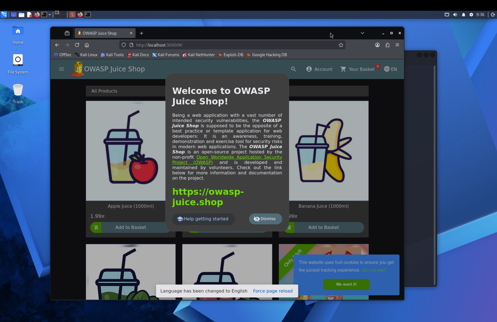

## 6. Ejecución de crAPI en ambiente dockerizado

Descarga y ejecución del contenedor de crAPI (Completely Ridiculous API) mediante Docker.

crAPI resultó ser bastante más armado que Juice Shop, así que en vez de levantar un contenedor suelto tuve que seguir la guía oficial paso a paso.

- Busqué en Google "owasp crapi containerized image" y el primer resultado llevaba a la organización crapi en Docker Hub.
- Ahí vi que no hay una sola imagen, sino 7 repositorios distintos (mailhog, gateway-service, crapi-web, crapi-community, crapi-chatbot, crapi-workshop, crapi-identity) porque crAPI es una arquitectura de microservicios, no una app monolítica. Con tantas piezas sueltas, preferí no armar el `docker run` a mano e ir por algo más prolijo.
- Entré a la página oficial del proyecto en owasp.org (owasp.org/www-project-crapi/), que confirma que crAPI simula una plataforma de dueños de vehículos, enfocada en vulnerabilidades de API (OWASP API Top 10) y no en los clásicos XSS/SQLi.
- Desde ahí fui al repositorio en GitHub (github.com/OWASP/crAPI) y leí la sección "Docker and docker compose" del README, que explica que hace falta Docker y docker compose 1.27.0 o superior, y da los comandos para usar las imágenes prebuilt.
- Descargué el código del repo con `curl -L -o /tmp/crapi.zip https://github.com/OWASP/crAPI/archive/refs/heads/main.zip` y lo descomprimí con `unzip /tmp/crapi.zip`.
- Entré a la carpeta del deploy: `cd crAPI-main/deploy/docker`.
- Bajé todas las imágenes con `docker compose pull`: en total tiró 93/93 capas, correspondientes a los servicios crapi-web, crapi-community, api.mypremiumdealership.com, mongodb, crapi-chatbot, crapi-identity, mailhog, crapi-workshop, chromadb y postgresdb.
- Levanté todo el stack con `docker compose -f docker-compose.yml --compatibility up -d`.
- Según el propio README, la app queda expuesta en http://localhost:8888, y los correos que envía la aplicación (por ejemplo, para el registro de usuarios) se capturan en MailHog, en http://localhost:8025.
- Entré a ambas URLs desde el navegador para confirmar que funcionaban.

**Resultado:** en localhost:8888/login cargó correctamente la pantalla de login de crAPI, y en localhost:8025 cargó MailHog conectado y a la espera de correos, confirmando que todo el stack de microservicios había quedado operativo.

**6.8** Validar que se pueda acceder a la aplicación.
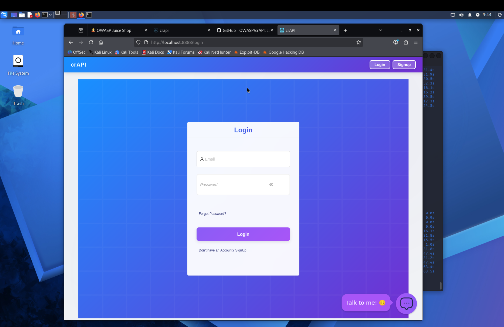

**6.9** Validación del segundo front de la app.
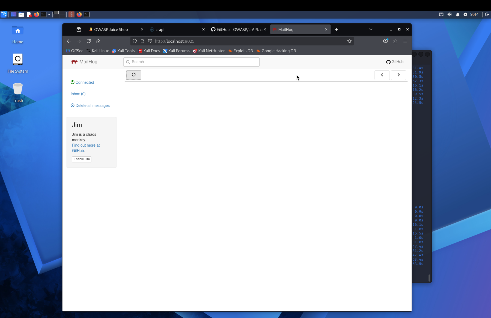

## 7. Prueba de visualización del tráfico en el proxy de interceptación

### 7.1 Configuración de FoxyProxy

Configuración de la extensión FoxyProxy en el navegador para enrutar el tráfico hacia el listener de Burp Suite (127.0.0.1:8080).

- Entré a getfoxyproxy.org/downloads/ y, de las opciones de navegador disponibles (Chrome, Firefox, Microsoft Edge, Safari), elegí Chrome.
- Eso me llevó a la Chrome Web Store, a la página de la extensión FoxyProxy (desarrollada por Beholder Corporation, 3.8 estrellas con 805 valoraciones y 600.000 usuarios) y le di a "Add to Chrome".
- Abrí las opciones de la extensión, fui a la pestaña "Proxies" y usé "Add" para cargar un proxy nuevo.
- Lo configuré para que apuntara al listener de Burp: Título 8080, Tipo HTTP, Hostname 127.0.0.1, Puerto 8080.
- Guardé y abrí el menú de FoxyProxy desde la barra del navegador para confirmar que el proxy quedara disponible para seleccionar.

**Resultado:** el proxy 8080 apareció listado en el menú de FoxyProxy, listo para activarse y enrutar el tráfico del navegador hacia Burp.

**7.1.1** Descarga del plugin para Chromium.
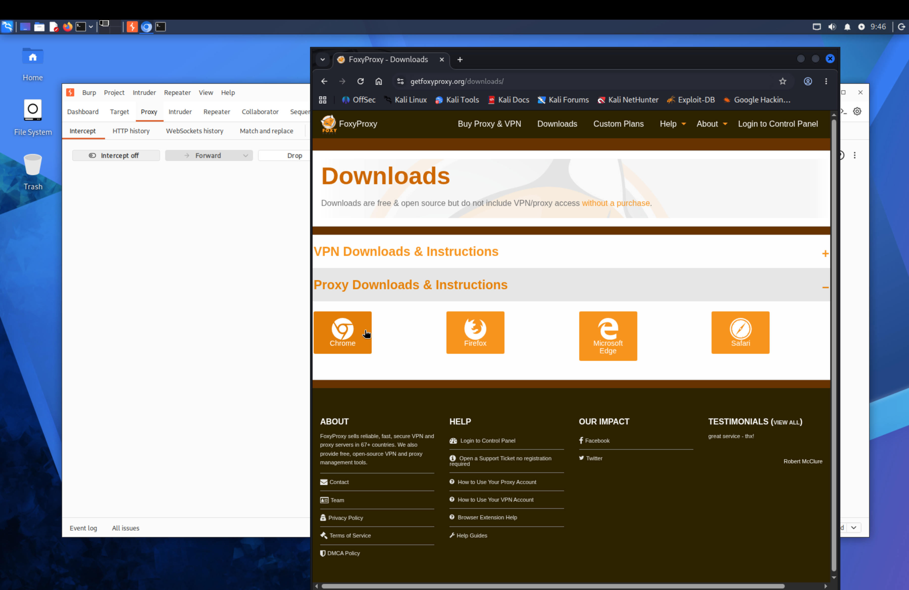

### 7.2 Instalación del certificado CA de Burp

Instalación del certificado CA generado por Burp Suite en el navegador, y verificación de la interceptación de tráfico HTTPS (en este caso, contra OWASP Juice Shop).

- Antes que nada, en Burp fui a Proxy settings y confirmé que el listener siguiera activo en 127.0.0.1:8080 con certificado "Per-host" — el mismo host y puerto que acababa de cargar en FoxyProxy.
- Con el proxy de FoxyProxy activado, navegué a http://burp/ (la página que Burp expone en su propio listener) y le di clic a "CA Certificate", arriba a la derecha.
- El navegador descargó el archivo cacert.der (987 bytes) a la carpeta de Descargas.
- Fui al administrador de certificados de Chrome (chrome://certificate-manager) → "Local certificates" → "Your certificates" → Import, y seleccioné el archivo cacert.der desde ~/Downloads.
- Confirmé la importación: en "Local certificates" → "Installed by you" apareció listado el certificado PortSwigger CA bajo "Trusted Certificates".
- Activé el proxy 8080 en FoxyProxy y prendí el Intercept en Burp ("Intercept on").
- Para probar la interceptación, navegué a juiceshop.local:3000 (usando el hostname configurado en vez de localhost).

**Resultado:** en la pestaña Proxy → Intercept de Burp aparecieron capturadas, en tiempo real, las requests GET del navegador hacia Juice Shop —/socket.io/, /assets/i18n/en.json, /rest/admin/application-configuration, /rest/admin/application-version, /api/Challenges/, /rest/languages—, confirmando que el certificado quedó instalado correctamente y que Burp estaba interceptando el tráfico HTTP/HTTPS entre el navegador y la aplicación.

**7.2.1** Validación del proxy del Burp para que encaje con el del Foxy.
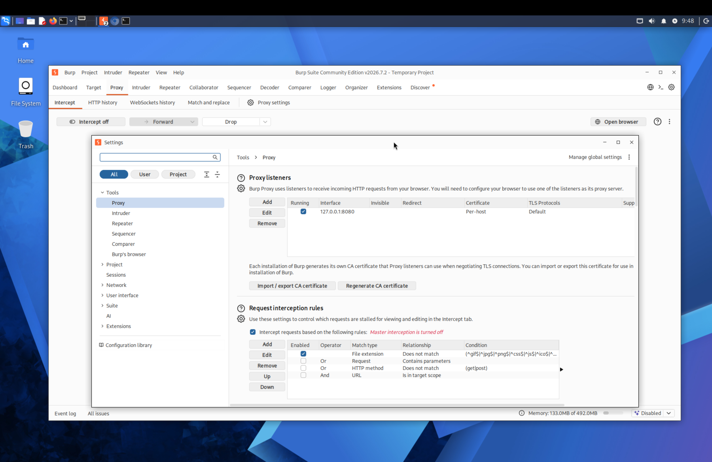

**7.2.6** Interceptor prendido.
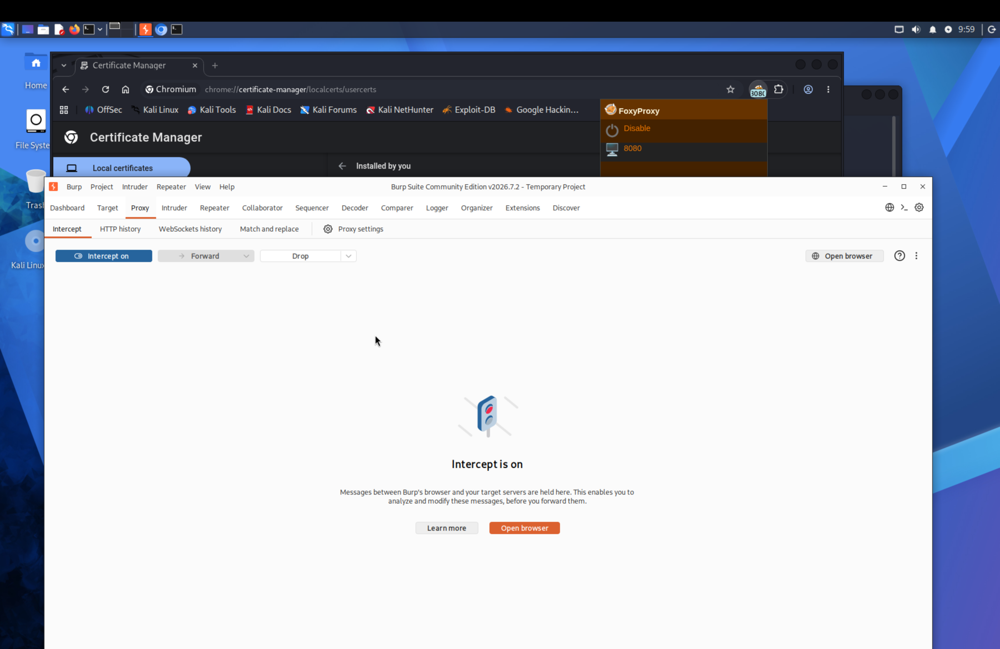

**7.2.7** Validación de captura de tráfico entre el host y el contenedor.
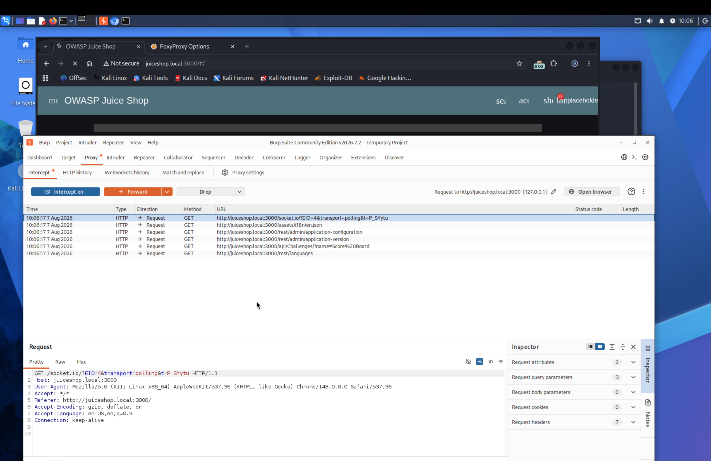
