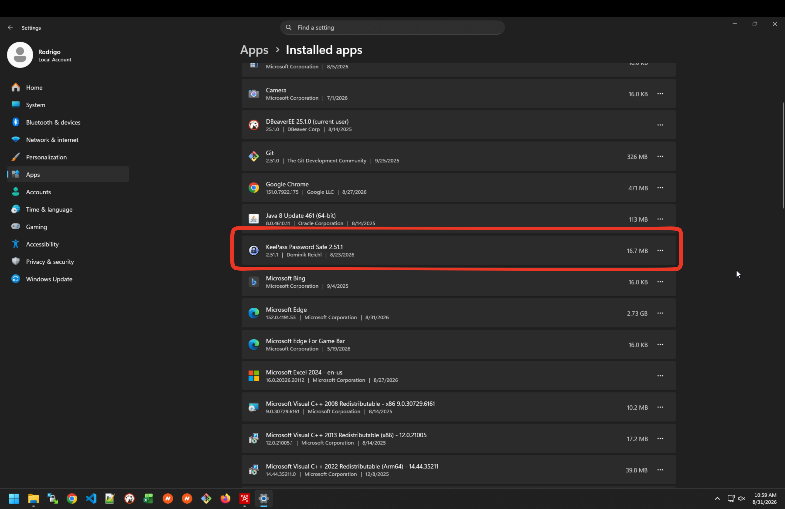
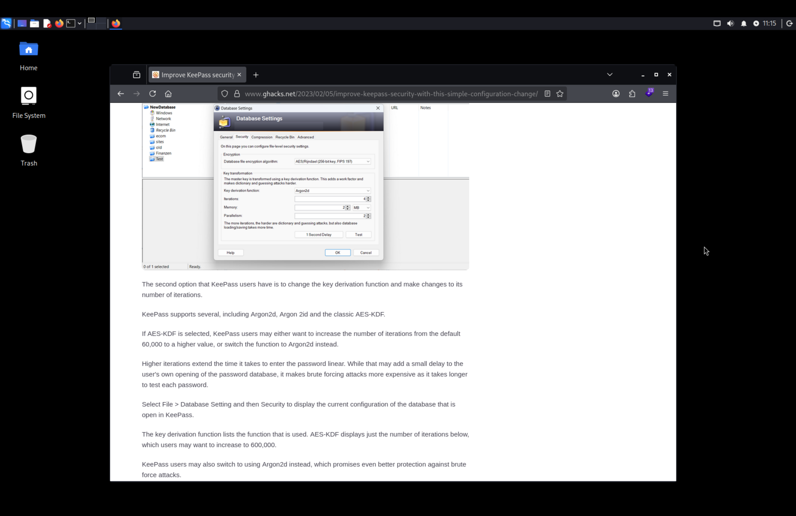
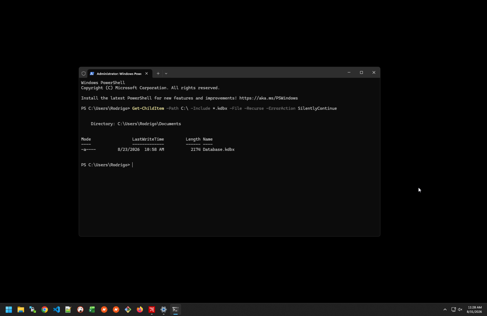
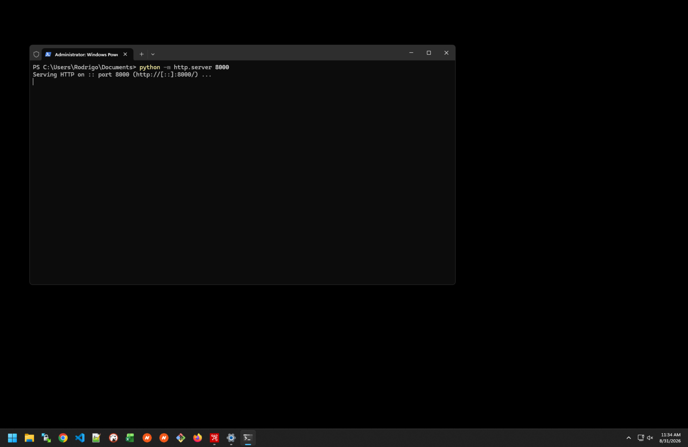
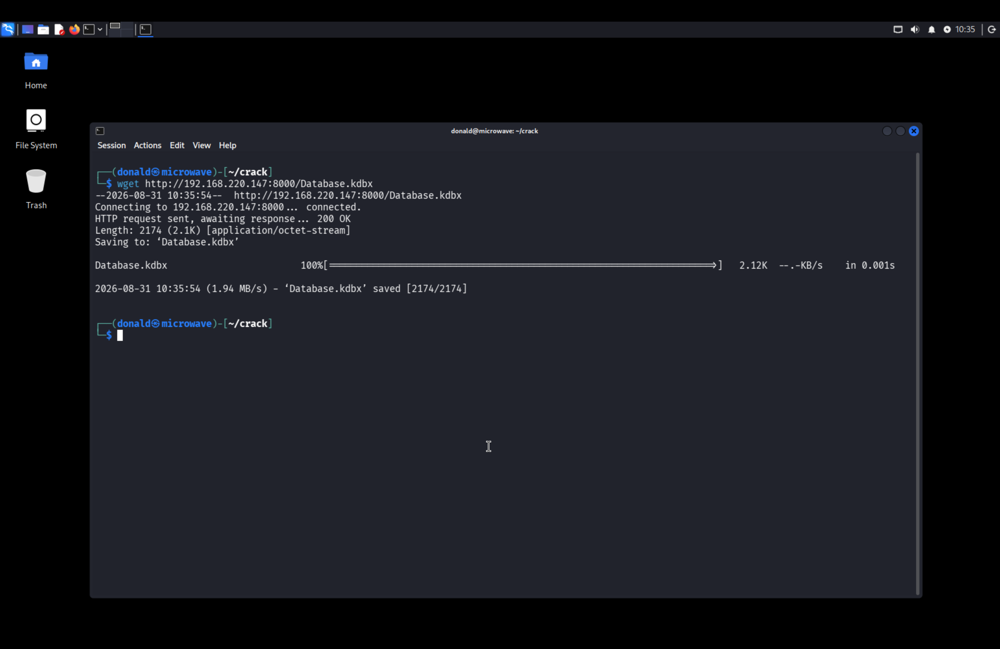
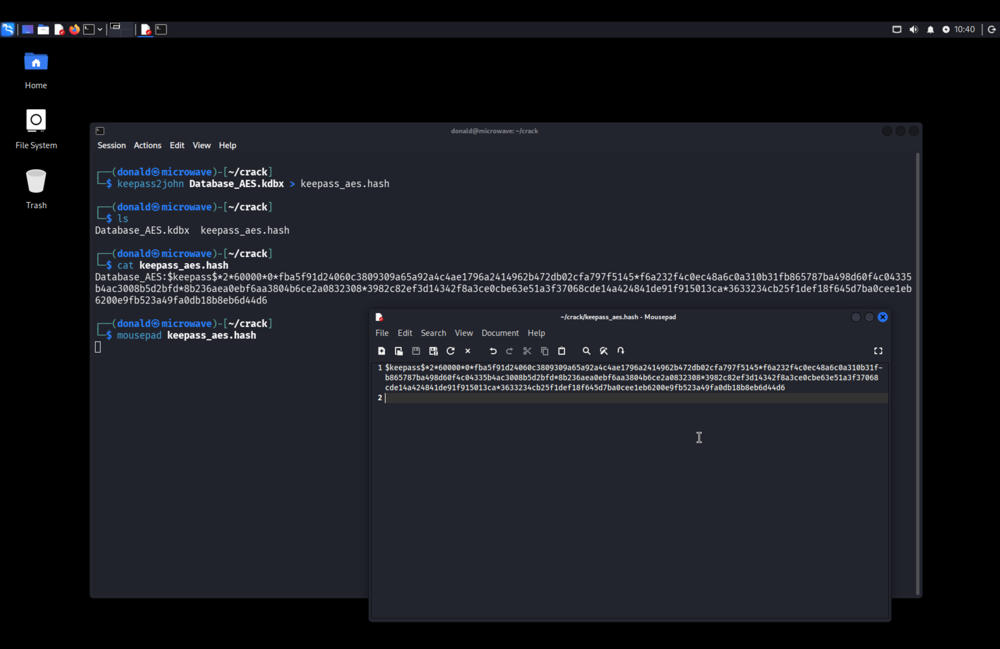
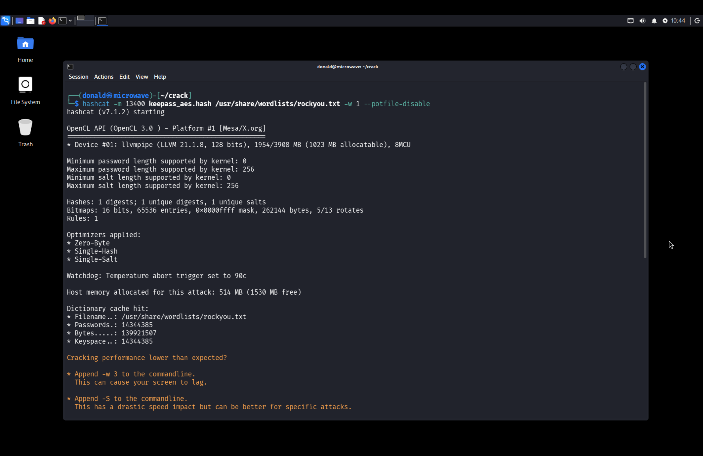
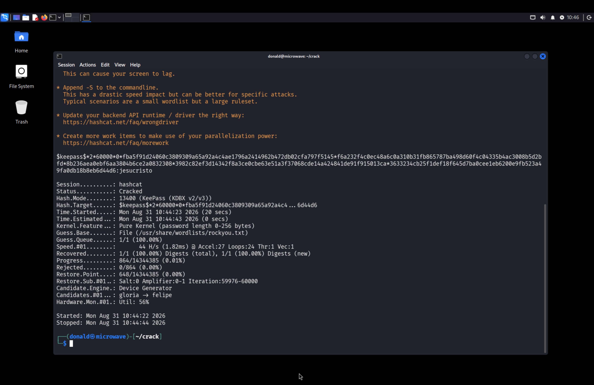
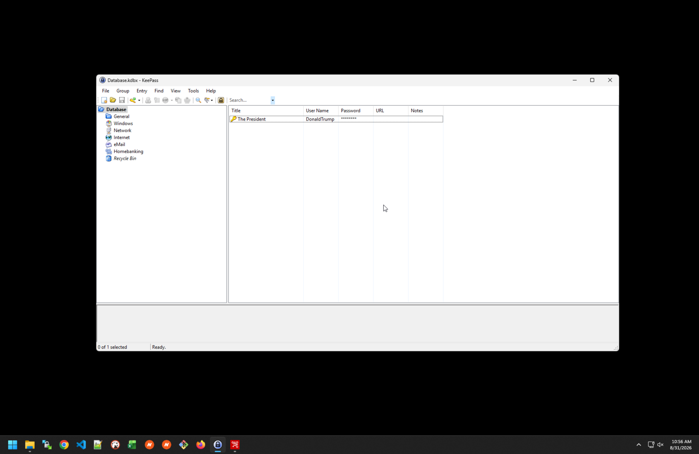
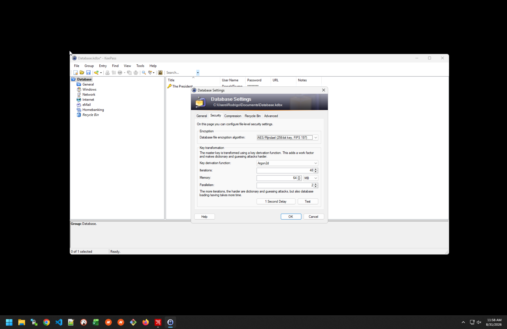

# Write-up 2: Explotación de KeePass mediante fallas criptográficas (AES-KDF débil) — Desarrollo de Software Seguro

**Autor:** Rodrigo Perdomo

**Fecha:** 31 de agosto de 2026

> **Disclaimer:** la redacción de este documento es propia. La organización del material —estructura, formato Markdown y disposición de las capturas de pantalla— fue realizada con la asistencia de una herramienta de IA.


## Índice

- [1. Contexto](#1-contexto)
- [2. Reconocimiento del sistema comprometido](#2-reconocimiento-del-sistema-comprometido)
- [3. Investigación de la vulnerabilidad](#3-investigación-de-la-vulnerabilidad)
- [4. Explotación](#4-explotación)
  - [4.1 Enumeración de archivos .kdbx](#41-enumeración-de-archivos-kdbx)
  - [4.2 Exfiltración vía servidor HTTP](#42-exfiltración-vía-servidor-http)
  - [4.3 Conversión a hash y ataque de fuerza bruta](#43-conversión-a-hash-y-ataque-de-fuerza-bruta)
- [5. Validación del acceso obtenido](#5-validación-del-acceso-obtenido)
- [6. Remediación](#6-remediación)

## 1. Contexto

El escenario parte de un atacante que ya obtuvo acceso remoto a una máquina Windows víctima mediante RDP (Remote Desktop Protocol). A partir de ese acceso inicial se ejecutan las etapas descritas a continuación.

## 2. Reconocimiento del sistema comprometido

Una vez dentro, el atacante ejecuta la etapa de reconocimiento, en la que recopila información valiosa del sistema en busca de posibles debilidades explotables.

- Aunque en esta fase suelen emplearse scripts y herramientas automatizadas de enumeración, en este caso el atacante revisa directamente las aplicaciones instaladas en el equipo.
- Encuentra KeePass Password Safe en su versión 2.51.1, lo que confirma que el usuario de esta máquina utiliza este gestor de contraseñas.

**Resultado:** se confirma la presencia de KeePass 2.51.1 como aplicación instalada, dato que orienta el resto del ataque.

**Imagen 3.** Listado de aplicaciones instaladas en el equipo víctima, donde se identifica KeePass Password Safe 2.51.1.


## 3. Investigación de la vulnerabilidad

Con la versión identificada, se realiza una búsqueda en internet para revisar si existen fallas conocidas asociadas a ella.

- A los efectos de este trabajo, y para ejemplificar la categoría **A04:2025 – Cryptographic Failures** del OWASP Top 10:2025, se investigan específicamente debilidades relacionadas con el cifrado de la base de datos de KeePass.

- La búsqueda arroja que KeePass 2.x usa por defecto **AES-KDF con 60.000 iteraciones** como función de derivación de clave (KDF), un valor bajo frente a alternativas más modernas como Argon2.

**Fuente:** https://www.ghacks.net/2023/02/05/improve-keepass-security-with-this-simple-configuration-change/

**Imagen 4.** Captura tomada durante la investigación sobre la seguridad de KeePass.



Con esta información, el objetivo pasa a ser explotar esta debilidad como vector de ataque, mediante fuerza bruta con diccionario.

## 4. Explotación

### 4.1 Enumeración de archivos .kdbx

Se continúa obteniendo información mediante un script de PowerShell que busca bases de datos de KeePass en el disco:

```powershell
Get-ChildItem -Path C:\ -Include *.kdbx -File -Recurse -ErrorAction SilentlyContinue
```

**Explicación del comando:**

- `Get-ChildItem`: cmdlet de PowerShell equivalente a `ls`/`dir`; lista el contenido de un directorio.
- `-Path C:\`: toma la unidad completa como punto de partida de la búsqueda.
- `-Include *.kdbx -File`: filtra únicamente archivos (no carpetas) cuya extensión sea `.kdbx`, el formato de base de datos de KeePass.
- `-Recurse`: hace que la búsqueda recorra todas las subcarpetas de la unidad, no solo el directorio raíz.
- `-ErrorAction SilentlyContinue`: suprime los errores de "acceso denegado" que normalmente aparecen al intentar leer carpetas del sistema sin permisos suficientes, evitando que la ejecución se corte o que la salida se llene de ruido.

**Resultado:** el comando encuentra `Database.kdbx` en `C:\Users\Rodrigo\Documents`.

**Imagen 5.** Salida por consola de la búsqueda de archivos `.kdbx`.


Con esto se encuentra una base de datos de KeePass, supuestamente protegida con el método de cifrado débil identificado en la etapa anterior.

### 4.2 Exfiltración vía servidor HTTP

Para transferir el archivo a la máquina del atacante, en la víctima se abre un servidor HTTP en el puerto 8000, sirviendo la ruta donde se encuentra el archivo:

```
python -m http.server 8000
```

**Explicación del comando:**

- `python -m http.server 8000`: levanta un servidor HTTP mínimo, incluido en la librería estándar de Python, que sirve el contenido del directorio actual (en este caso, donde se encuentra `Database.kdbx`) en el puerto 8000. Es una forma rápida de exfiltrar archivos sin depender de herramientas externas: cualquier equipo con conectividad hacia la víctima puede descargarlos con un cliente HTTP como `wget` o `curl`.

**Imagen 6.** Servidor HTTP levantado en la máquina víctima sobre el puerto 8000.


En la máquina del atacante —que ya conocía la IP de la víctima por haberla comprometido previamente vía RDP— se descarga el archivo:

```
wget http://192.168.220.147:8000/Database.kdbx
```

**Imagen 7.** Descarga del archivo `Database.kdbx` desde la máquina atacante.


### 4.3 Conversión a hash y ataque de fuerza bruta

Para romper este cifrado, primero hay que traducir el archivo `.kdbx` a un formato de hash interpretable por las herramientas de cracking adecuadas. Para esto se usa `keepass2john` (parte del paquete `john`), y además se le retira el nombre del archivo al hash generado para que sea manipulable correctamente por hashcat:

```
keepass2john Database_AES.kdbx > keepass_aes.hash
```

**Imagen 8.** Generación del hash con `keepass2john` y edición del archivo para eliminar el prefijo con el nombre del archivo.


Una vez tratado el hash, se ejecuta hashcat para descifrarlo, eligiendo el modo correspondiente al formato de KeePass que se quiere atacar (modo `13400`, KeePass KDBX v2/v3) y usando como wordlist `rockyou.txt`:

```
hashcat -m 13400 keepass_aes.hash /usr/share/wordlists/rockyou.txt -w 1 --potfile-disable
```

**Explicación del comando:**

- `hashcat`: herramienta de cracking de hashes por GPU/CPU.
- `-m 13400`: selecciona el modo de hash "KeePass (KDBX v2/v3)".
- `keepass_aes.hash`: archivo de entrada con el hash extraído previamente.
- `/usr/share/wordlists/rockyou.txt`: wordlist utilizada para el ataque de diccionario, con cerca de 14,3 millones de contraseñas.
- `-w 1`: define el *workload profile* (perfil de rendimiento); `1` es el más bajo, priorizando no saturar recursos del equipo por sobre la velocidad.
- `--potfile-disable`: evita que hashcat consulte o guarde el resultado en su *potfile* (caché de hashes ya crackeados previamente), forzando a que el ataque se ejecute de punta a punta.

**Imagen 9.** Inicio del ataque de fuerza bruta con hashcat.


Tras haber esperado un momento, se observa que hashcat logra descifrar el hash y revela la contraseña maestra de la base de datos: **`jesucristo`**.

**Imagen 10.** Hash crackeado por hashcat, con la contraseña en texto plano.


## 5. Validación del acceso obtenido

Tras haber descubierto la contraseña del archivo, se procede a validarla directamente en la máquina víctima, abriendo la base de datos con KeePass. Dentro se encuentra una entrada llamada "The President", con usuario `DonaldTrump` y una contraseña almacenada.

**Imagen 11.** Base de datos `Database.kdbx` abierta en KeePass usando la contraseña obtenida, mostrando la entrada "The President".


Además, se valida el algoritmo y la configuración de cifrado utilizada por la base de datos, confirmando lo investigado en la etapa de reconocimiento: cifrado AES/Rijndael de 256 bits, con función de derivación de clave AES-KDF y 60.000 iteraciones.

**Imagen 12.** Configuración de seguridad de la base de datos (`Database Settings → Security`), confirmando AES-KDF con 60.000 iteraciones.


## 6. Remediación

El fabricante recomienda reemplazar AES-KDF por un algoritmo de derivación de clave más robusto, como **Argon2**, ajustando tres parámetros:

- **Iteraciones:** mínimo recomendado, 2.
- **Memoria:** mínimo entre (RAM mínima del dispositivo / 2) y 1 GB.
- **Paralelismo:** número mínimo de núcleos lógicos entre los dispositivos donde se abre la base de datos.

KeePass facilita este ajuste con el botón **"1 Second Delay"** en la configuración de seguridad de la base de datos, que calibra automáticamente estos parámetros para que la apertura de la base demore aproximadamente 1 segundo, dificultando así los ataques de fuerza bruta.

**Imagen 13.** Base de datos reconfigurada con Argon2d tras usar el botón "1 Second Delay" (48 iteraciones, 64 MB de memoria, paralelismo 2).


De esta forma, el hash resultante se vuelve computacionalmente inviable de descifrar con las mismas técnicas utilizadas en este ataque.